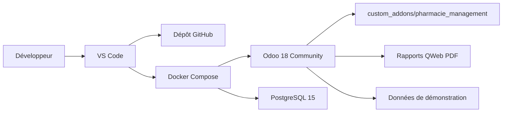
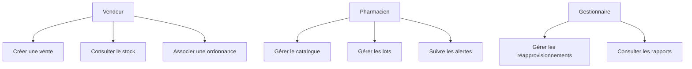
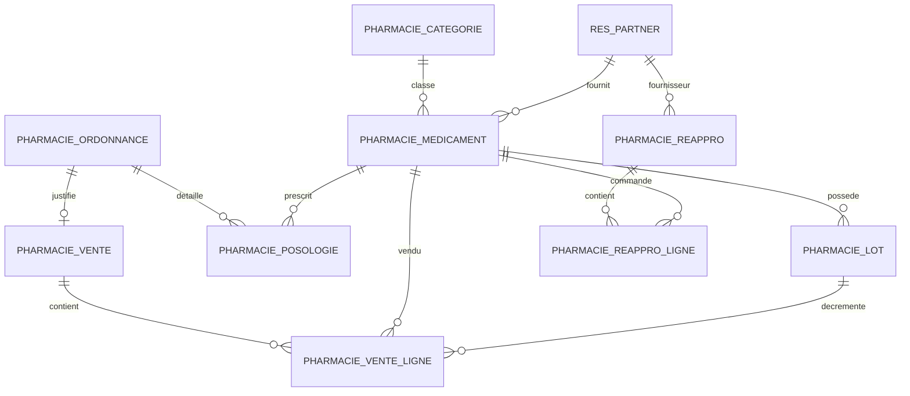

# Rapport technique - Projet ERP Odoo

**République du Sénégal**
**Un Peuple - Un But - Une Foi**
**Université Alioune Diop de Bambey**
**Master 2 Data Science et Génie Logiciel**

## Gestion de Pharmacie avec Odoo 18 Community

**Module développé :** `pharmacie_management`
**Dépôt GitHub :** <https://github.com/nakir00/m2_dsgl_2026_erp_odoo>
**GitHub Project :** <https://github.com/users/nakir00/projects/1>
**Année académique :** 2025-2026

**Présenté par :**
Mouhamed Naby Mbaye
À compléter avec les autres membres du groupe

**Encadrement :**
À compléter

---

## Résumé

Ce rapport présente le travail réalisé dans le cadre du projet ERP Odoo du Master 2 DSGL 2026. L'objectif est de concevoir et développer un module Odoo 18 Community nommé `pharmacie_management`, destiné à gérer les opérations courantes d'une pharmacie : catalogue des médicaments, gestion des lots, suivi des stocks, ventes avec ou sans ordonnance, réapprovisionnement fournisseur, sécurité par profils et génération de rapports.

Le projet a été structuré autour d'un dépôt GitHub, d'un GitHub Project et d'un backlog de tickets. L'environnement de développement local repose sur Docker Compose afin de faciliter le lancement d'Odoo 18 et de PostgreSQL sans installation système lourde. Le module Odoo contient les modèles métiers, vues XML, règles de sécurité, assistants, rapports QWeb et données de démonstration nécessaires pour couvrir le cahier des charges.

**Mots-clés :** Odoo 18, ERP, pharmacie, Docker Compose, PostgreSQL, GitHub Project, QWeb, sécurité Odoo.

---

## Table des matières

1. Introduction
2. Analyse du sujet et objectifs
3. Organisation du projet
4. Architecture technique
5. Modélisation fonctionnelle
6. Modélisation des données
7. Réalisation du module Odoo
8. Sécurité et gestion des rôles
9. Interfaces, assistants et rapports
10. Données de démonstration
11. Gestion du projet avec GitHub
12. Tests et validation
13. Difficultés rencontrées
14. Limites et perspectives
15. Conclusion
16. Annexes

---

## 1. Introduction

Les systèmes ERP permettent de centraliser les processus métiers d'une organisation dans une plateforme unique. Dans le contexte d'une pharmacie, un ERP doit permettre de suivre les produits, les stocks, les ventes, les ordonnances, les fournisseurs et les opérations de caisse.

Odoo est une solution ERP modulaire qui permet d'étendre le système grâce à des modules personnalisés. Le projet consiste donc à développer un module spécifique répondant aux besoins d'une pharmacie, tout en respectant les conventions de développement d'Odoo 18 Community.

Le travail réalisé ne se limite pas au code du module. Il inclut également la préparation du dépôt, la mise en place d'un environnement Docker Compose, la structuration du backlog GitHub, les recommandations d'environnement de développement et la documentation technique.

## 2. Analyse du sujet et objectifs

Le sujet d'examen demande la réalisation d'un module Odoo fonctionnel permettant la gestion d'une pharmacie. Le module doit couvrir les fonctionnalités principales suivantes :

- gérer le catalogue des médicaments ;
- suivre les lots et les dates de péremption ;
- afficher les alertes de rupture et de péremption ;
- enregistrer les ventes au comptoir ;
- gérer les ventes avec ou sans ordonnance ;
- associer un scan d'ordonnance à une vente ;
- gérer les réapprovisionnements fournisseurs ;
- appliquer des droits selon les profils utilisateurs ;
- générer les documents et rapports demandés.

Les livrables attendus sont principalement :

- un module Odoo 18 Community installable ;
- des données de démonstration ;
- un rapport technique final ;
- des captures d'écran montrant le fonctionnement du module ;
- une organisation claire du travail de groupe.

## 3. Organisation du projet

Le dépôt GitHub a été préparé pour supporter un travail collaboratif. La structure actuelle est la suivante :

```text
.
├── .github/
│   ├── ISSUE_TEMPLATE/
│   ├── workflows/
│   ├── labels.yml
│   └── PULL_REQUEST_TEMPLATE.md
├── .vscode/
│   ├── extensions.json
│   └── settings.json
├── custom_addons/
│   └── pharmacie_management/
├── docs/
├── odoo/
│   └── odoo.conf
├── docker-compose.yml
├── AGENTS.md
└── README.md
```

Le dossier `custom_addons/pharmacie_management/` contient le module métier. Le dossier `docs/` regroupe la documentation de travail : workflow GitHub, environnement Docker Compose, recommandations VS Code, règles pratiques Odoo 18 et rapports.

## 4. Architecture technique

Le projet utilise une architecture simple et reproductible basée sur Docker Compose. Deux services principaux sont définis :

- `odoo` : serveur Odoo 18 Community ;
- `db` : base de données PostgreSQL 15.

Le service Odoo utilise directement l'image officielle `odoo:18`. Le module personnalisé est monté à travers le volume `./custom_addons:/mnt/custom_addons`. La configuration Odoo déclare ce chemin dans `addons_path`, ce qui permet à Odoo de détecter le module `pharmacie_management`. PostgreSQL possède un healthcheck et son port n'est pas publié sur la machine hôte ; Odoo attend donc que la base soit saine avant de démarrer.



Le seul port publié par défaut est Odoo : `http://localhost:8072`. PostgreSQL reste accessible depuis les services Docker, notamment par `docker compose exec db` pour les opérations de sauvegarde.

Les commandes de base sont :

```bash
docker compose up -d
docker compose logs -f odoo
docker compose down
```

## 5. Modélisation fonctionnelle

Les principaux acteurs identifiés sont :

- **Vendeur** : consulte le stock, crée des ventes, associe une ordonnance si nécessaire ;
- **Pharmacien** : gère les médicaments, lots, ordonnances, ventes et alertes ;
- **Gestionnaire** : supervise les fournisseurs, réapprovisionnements, rapports et paramètres ;
- **Client** : achète des médicaments, avec ou sans ordonnance ;
- **Fournisseur** : fournit les médicaments lors des commandes de réapprovisionnement.

Les cas d'utilisation principaux sont :

- consulter le catalogue ;
- créer ou modifier un médicament ;
- enregistrer un lot ;
- consulter les alertes ;
- créer une vente ;
- confirmer ou annuler une vente ;
- joindre une ordonnance ;
- créer une commande fournisseur ;
- réceptionner une commande ;
- générer un ticket de caisse ;
- générer un bilan de caisse ;
- imprimer un inventaire de stock ;
- imprimer un bon de commande fournisseur.



## 6. Modélisation des données

Le module repose sur plusieurs modèles Odoo liés entre eux. Les principaux modèles sont :

- `pharmacie.medicament` ;
- `pharmacie.categorie` ;
- `pharmacie.lot` ;
- `pharmacie.ordonnance` ;
- `pharmacie.posologie` ;
- `pharmacie.vente` ;
- `pharmacie.vente.ligne` ;
- `pharmacie.reappro` ;
- `pharmacie.reappro.ligne` ;
- `res.partner`, étendu pour les fournisseurs pharmaceutiques.



Cette modélisation permet de relier les ventes aux lignes de vente, les lignes aux lots, les lots aux médicaments, et les médicaments aux fournisseurs et catégories. Les ordonnances peuvent être rattachées aux ventes pour les produits qui l'exigent.

## 7. Réalisation du module Odoo

### 7.1 Manifest et structure

Le module est déclaré dans `custom_addons/pharmacie_management/__manifest__.py`. Il est nommé "Gestion de Pharmacie", utilise la version `18.0.1.1.0`, et dépend des modules Odoo `base` et `web`. La dépendance directe à `mail` a été retirée car le module métier ne l'utilise pas.

L'ordre de chargement du manifest respecte les conventions Odoo :

1. groupes de sécurité ;
2. droits d'accès ;
3. règles d'enregistrement ;
4. données techniques ;
5. vues ;
6. assistants ;
7. menus ;
8. rapports QWeb.

### 7.2 Catalogue des médicaments

Le modèle `pharmacie.medicament` centralise les informations du médicament : nom commercial, DCI, forme, dosage, conditionnement, catégorie, fournisseur, prix d'achat, prix de vente, TVA, marge, vente sur ordonnance, notice et image.

Le stock actuel est calculé à partir des lots associés. Une alerte de rupture est également prévue afin d'identifier les médicaments à réapprovisionner.

### 7.3 Gestion des lots

Le modèle `pharmacie.lot` permet de suivre les quantités par lot. Chaque lot contient un numéro interne généré automatiquement, le numéro de lot communiqué par le fournisseur, les dates de fabrication, réception et péremption, une quantité initiale, une quantité restante et un statut. Lorsqu'il provient d'une commande, le lot conserve également le lien vers le bon et sa ligne de commande d'origine.

Des contraintes permettent de vérifier la cohérence des dates. Le statut du lot est calculé pour identifier les lots valides, expirés ou épuisés.

### 7.4 Ordonnances

Le modèle `pharmacie.ordonnance` permet d'enregistrer les informations du patient, du médecin, de la structure de santé, de la date de prescription, des médicaments prescrits et du scan de l'ordonnance.

Le modèle `pharmacie.posologie` permet d'associer des instructions de prise à chaque médicament prescrit.

### 7.5 Ventes

Le modèle `pharmacie.vente` gère les ventes au comptoir. Une vente contient le client, le vendeur, le mode de paiement, l'ordonnance éventuelle et les lignes de vente.

Les montants HT, TVA et TTC sont calculés automatiquement. La confirmation d'une vente diminue les quantités restantes dans les lots. L'annulation restaure les stocks.

Une règle métier bloque la vente d'un médicament soumis à ordonnance lorsque la vente ne contient pas d'ordonnance associée.

Le mécanisme FEFO sélectionne actuellement le lot valide dont la péremption est la plus proche, à condition qu'un seul lot couvre toute la quantité demandée. La répartition automatique d'une vente sur plusieurs lots reste une limite connue, documentée pour ne pas masquer ce comportement pendant la démonstration.

### 7.6 Réapprovisionnement

Le modèle `pharmacie.reappro` gère les commandes fournisseurs. Il contient le fournisseur, la date de commande, la date de livraison prévue, le statut et les lignes de commande.

La réception s'effectue au moyen d'un assistant dédié. Il présente une ligne par produit encore attendu et permet de saisir la quantité réellement livrée, le numéro de lot fournisseur ainsi que les dates de fabrication, réception et péremption. Chaque ligne reçue crée un lot durable : les lots sont donc la source de vérité de la traçabilité.

La quantité déjà reçue et le reliquat sont calculés à partir des lots liés à chaque ligne de commande. Une sur-réception est refusée. Après une première livraison incomplète, le bon passe à l'état `Reçu partiellement`; il passe à `Reçu` lorsque toutes les quantités commandées ont été livrées.

## 8. Sécurité et gestion des rôles

Trois groupes de sécurité ont été créés :

| Groupe | Rôle principal |
| --- | --- |
| Vendeur | Consulter le stock et créer des ventes |
| Pharmacien | Gérer les médicaments, lots, ordonnances et ventes |
| Gestionnaire | Superviser les achats, paramètres et rapports |

Les droits d'accès sont définis dans `security/ir.model.access.csv`. Les vendeurs ont des droits limités, notamment en écriture et suppression. Les pharmaciens et gestionnaires disposent de droits plus larges selon les objets métiers.

Des règles d'enregistrement ont été ajoutées pour limiter la visibilité des ventes : un vendeur ne voit que ses propres ventes, tandis que le pharmacien et le gestionnaire peuvent consulter l'ensemble des ventes.

La validation d'une réception fournisseur est réservée au Gestionnaire, à la fois dans l'interface et dans le code serveur. Le superutilisateur Odoo conserve son droit d'administration habituel.

## 9. Interfaces, assistants et rapports

Les interfaces Odoo ont été créées dans le dossier `views/`. Elles couvrent les listes, formulaires, recherches, menus et vues kanban nécessaires au module.

Le menu principal "Pharmacie" est organisé autour des entrées suivantes :

- Caisse ;
- Ordonnances ;
- Stock ;
- Fournisseurs ;
- Rapports ;
- Configuration.

Trois assistants ont été développés :

- `pharmacie.reappro.auto.wizard` : propose des réapprovisionnements automatiques ;
- `pharmacie.reappro.reception.wizard` : enregistre une livraison totale ou partielle avec la traçabilité des lots ;
- `pharmacie.bilan.caisse.wizard` : calcule le chiffre d'affaires et le nombre de ventes sur une période.

Quatre rapports QWeb PDF ont été créés :

- ticket de caisse ;
- inventaire de stock ;
- bilan de caisse ;
- bon de commande fournisseur.

## 10. Données de démonstration

Des données de démonstration ont été ajoutées afin de tester et présenter rapidement le module :

- médicaments ;
- catégories ;
- fournisseurs ;
- lots ;
- ordonnances ;
- ventes confirmées.

Ces données permettent de valider les scénarios principaux : consultation du catalogue, suivi du stock, vente, ordonnance, rupture, réapprovisionnement et édition de rapports.

## 11. Gestion du projet avec GitHub

Le projet a été piloté avec GitHub Issues et GitHub Projects. Le backlog contient 75 issues dans le GitHub Project `examen erp odoo dsgl 2026`, dont l'issue `#75` consacrée à la réception partielle et à la traçabilité des lots.

Les tickets ont été regroupés par grands thèmes :

- environnement et configuration ;
- module Odoo ;
- modèles métiers ;
- vues et menus ;
- sécurité ;
- ventes et stock ;
- ordonnances ;
- réapprovisionnement ;
- rapports ;
- données de démonstration ;
- tests ;
- documentation ;
- déploiement.

Le workflow `project-sync.yml` déplace automatiquement les issues liées vers l'état `Done` lors de leur fermeture ou du merge d'une pull request. Le workflow `odoo-check.yml` valide la configuration Docker Compose puis installe le module dans une base PostgreSQL temporaire avec les tests Odoo filtrés sur `pharmacie_management`.

Les premiers commits importants sont :

| Commit | Description |
| --- | --- |
| `2134689` | Initialisation du workflow GitHub |
| `20c2fa8` | Ajout de l'environnement Docker Compose |
| `8bbbad9` | Automatisation du statut GitHub Project |
| `d6448c0` | Création du squelette du module Odoo |
| `5e4b974` | Création du manifest du module |

## 12. Tests et validation

Les vérifications techniques réalisées incluent :

- validation de la configuration Docker Compose avec `docker compose config` ;
- contrôle du diff Git avec `git diff --check` ;
- installation du module dans une base PostgreSQL isolée avec l'image officielle `odoo:18` ;
- validation du healthcheck PostgreSQL avant l'exécution Odoo ;
- exécution réussie des tests ciblés Odoo.

Les tests automatisés couvrent :

- l'inclusion d'une vente confirmée à `23:59:59` dans le bilan de caisse de la journée ;
- la réception de 3 puis 7 unités, avec deux lots fournisseur distincts ;
- la transition `Reçu partiellement` puis `Reçu` ;
- le refus d'une réception supérieure au reliquat ;
- le refus de la réception pour un utilisateur Pharmacien sans le rôle Gestionnaire.

La recette manuelle à réaliser dans l'interface Odoo reste :

1. installer le module dans une base propre ;
2. charger les données de démonstration ;
3. créer un médicament ;
4. créer un lot ;
5. créer une vente simple ;
6. créer une vente avec ordonnance ;
7. vérifier la décrémentation de stock ;
8. annuler une vente et vérifier la restauration du stock ;
9. créer et réceptionner un réapprovisionnement partiel, puis vérifier les deux lots créés ;
10. imprimer les quatre rapports QWeb ;
11. tester les droits avec les rôles Vendeur, Pharmacien et Gestionnaire.

## 13. Difficultés rencontrées

Plusieurs points ont demandé une attention particulière :

- adapter les conventions de développement aux changements d'Odoo 18 ;
- respecter l'ordre de chargement des fichiers XML et CSV dans le manifest ;
- éviter les attributs XML invalides dans les vues Odoo 18 ;
- corriger les noms de champs propres à Odoo, par exemple `users` sur `res.groups` ;
- gérer correctement les champs calculés et `compute_sudo` ;
- structurer un backlog détaillé sans perdre le lien avec le cahier des charges ;
- choisir un environnement Docker Compose simple au lieu d'une installation Ubuntu complète.

## 14. Limites et perspectives

Le module couvre l'essentiel du cahier des charges, mais plusieurs éléments doivent encore être finalisés avant le rendu :

- ajouter les captures d'écran réelles de l'interface Odoo ;
- compléter les diagrammes UML dans un format propre ;
- rédiger la répartition détaillée du travail entre les membres du groupe ;
- effectuer la recette complète dans Odoo et capturer ses résultats ;
- renseigner la répartition réelle du travail entre les membres du groupe.

Les perspectives d'amélioration incluent :

- répartition automatique d'une vente sur plusieurs lots FEFO ;
- tableau de bord de gestion des stocks ;
- notifications automatiques pour les lots proches de la péremption ;
- export Excel des ventes et stocks ;
- intégration future avec Keycloak ou LDAP pour l'authentification ;
- packaging de déploiement pour un environnement Kubernetes léger, à étudier séparément de la démonstration Docker Compose.

## 15. Conclusion

Le travail réalisé a permis de construire une base complète pour le projet ERP Odoo. Le dépôt GitHub est structuré, le backlog est créé, l'environnement Docker Compose est prêt, et le module `pharmacie_management` contient les fonctionnalités principales attendues.

Le projet est maintenant dans une phase de consolidation : il faut valider le comportement dans Odoo, produire les captures d'écran, compléter les diagrammes et finaliser le rapport de soutenance. La base actuelle permet de présenter un module cohérent, aligné avec les besoins d'une pharmacie et conforme à l'esprit du sujet d'examen.

---

## 16. Annexes

### Annexe A - Commandes utiles

```bash
docker compose up -d
docker compose ps
docker compose logs -f odoo
docker compose exec -T db pg_dump -U odoo pharmacie > sauvegarde-pharmacie.sql
docker compose down
```

### Annexe B - Fichiers principaux du module

```text
custom_addons/pharmacie_management/
├── __init__.py
├── __manifest__.py
├── data/
├── demo/
├── models/
├── report/
├── security/
├── views/
└── wizards/
```

### Annexe C - Captures d'écran à ajouter

- écran d'accueil Odoo ;
- installation du module ;
- menu Pharmacie ;
- liste des médicaments ;
- fiche médicament ;
- liste des lots ;
- alerte rupture ou péremption ;
- création d'une vente ;
- ordonnance avec scan ;
- réapprovisionnement ;
- réception partielle avec les deux lots fournisseur ;
- ticket de caisse ;
- inventaire de stock ;
- bilan de caisse ;
- bon de commande fournisseur ;
- GitHub Project avec les tickets.

### Annexe D - Répartition du travail

Cette partie doit être complétée avec les noms des membres de l'équipe et les tâches réalisées par chacun.

| Membre | Responsabilités |
| --- | --- |
| Mouhamed Naby Mbaye | À compléter |
| Membre 2 | À compléter |
| Membre 3 | À compléter |
| Membre 4 | À compléter |
